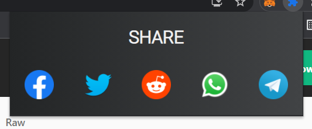

# URL SHARE EXTENSION

Extension to share URL of your current tab straight away with a click.


## About


If we want to share the url of current tab, WHAT WE USUALLY DO??

Copying it , Pasting it and Sharing on social media.

IN THIS EXTENSION , WE HAVE INCLUDED THE FUNCTIONALITY TO  ALLOW THE USER TO SHARE THE LINK OF THE CURRENT WEBPAGE TO DIFFERENT SOCIAL MEDIA HANDLES JUST WITH A CLICK.


Me: Heyy I found an amazing stuff on web 

She: Share url

Me (copying the url)

She: Are you there?????

Me:(opening facebook to share)

She:Are you ignoring me????

Me(Pasting the url)

She: Breakup

*blocked*
 
Dekha aapne laparvaahi ka natijaa??


## Lets kill this cliche of copy pasting with this extension...
## Set up


- Fork the Github repository

- Clone using command

```bash
  git clone [URL]
```

- Open chrome or any other preferred browser

- Go to more tools and then click extension


- Switch to developers mode

- Click  Load unpacked 

- Select the cloned folder

- Pin the Extension.

*Alright you are all set*
## How to use

- Open any webpage on any preferred browser

- Click on extension from pinned extensions

- Click on any social icon to share




  
## Contributors

 Yash Bhandari

 Apoorva Jain 
 
 Harshit Singh 
 
 Tushar Pasricha

 

Hours and Hours of discussion starting RIGHT from deciding the topic(Decided on second last day of submission;)) to the successful working of the project has lead to this site been made...

  